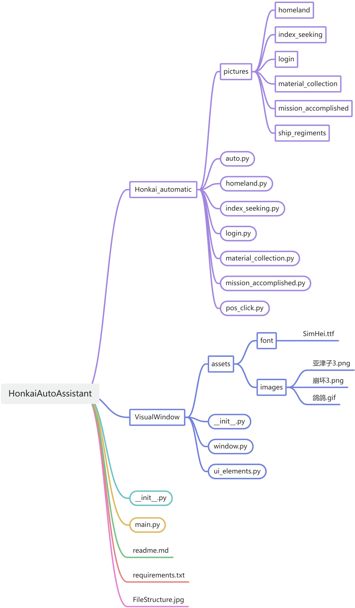

# 项目名称
<p style="color: #007AFF;font-size: 24px">HAA</p>


## 目录
1. [项目简介](#1-项目简介)  
2. [功能特性](#2-功能特性)  
3. [环境依赖](#3-环境依赖)  
4. [运行程序](#4-运行程序)
5. [项目结构](#5-项目结构)
6. [使用说明](#6-使用说明)


## 1. 项目简介
简要介绍项目的背景和解决的问题，例如：
- 该项目用于通过计算机视觉，完成崩坏3 任务。
- 提供多线程支持，提升并发处理能力。
- 支持多尺度匹配，适应不同分辨率的设备。

## 2. 功能特性
列出项目的核心功能，例如：
- **多尺度模板匹配**：支持不同屏幕分辨率下的操作。
- **实时更新界面**：使用 Pygame 构建动态交互界面。
- **消息管理**：支持消息滚动。
- **执行任务**：执行要求完成的任务。

## 3. 环境依赖
说明项目运行需要的环境和依赖项，例如：
- 操作系统：Windows
- Python 版本：3.7+
- 依赖库：
  ```bash
  pip install -r requirements.txt -i https://pypi.tuna.tsinghua.edu.cn/simple

  ```
## 4. 运行程序
**注意使用管理员权限运行**
   ```bash
   python auto.py
   ```

## 5. 项目结构


## 6. 使用说明
具体介绍项目的功能使用方法。：
1. 启动程序后，等待窗口中的 Logo 显示完成。
2. 左侧点击所选任务后，点击开始。
3. 打开 崩坏3。
4. 窗口中支持消息滚动。
5. 当前版本有很多逻辑不通顺的情况或bug，敬请期待更新。
